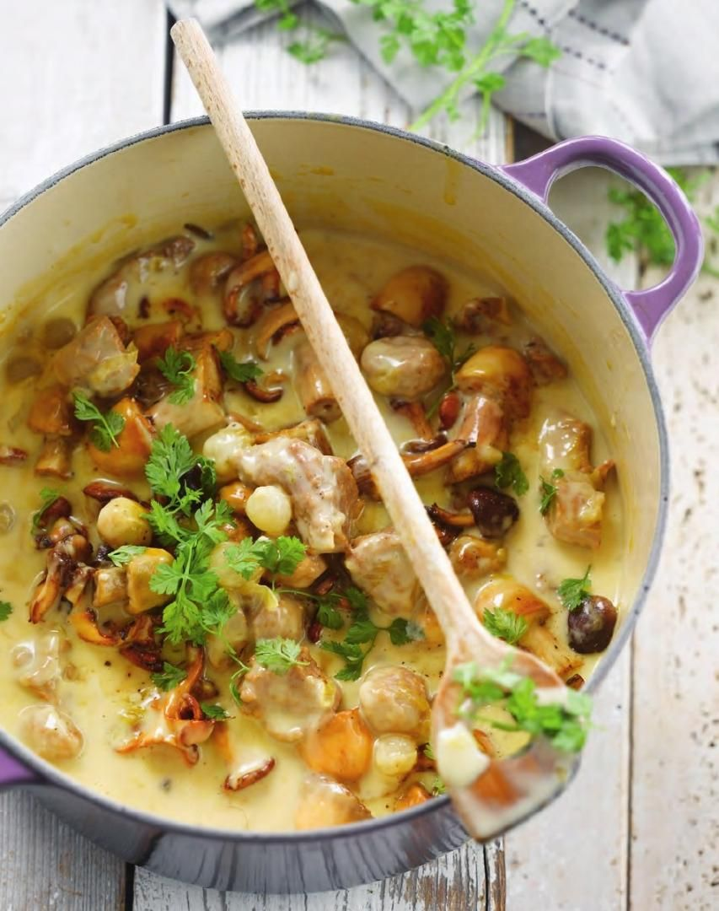

# Kalfsblanquette met champignons

Stoofgerecht voor de Creuset.

## Ingredienten

  * 1 kg kalfsstoofvlees, in stukken van 4 cm
  * 250 g kalfsgehakt
  * 1 sjalot
  * 1 stengel prei
  * 250 g   verschillende soorten champignons (kastanje, shiitake, oesterzwam, beukenzwam)
  * 20 zilveruitjes
  * 400 ml kalfsbouillon Maggi
  * 200 ml melk
  * 200 ml room
  * 1 bouquet garni
  * 3 kruidnagels
  * 3 eieren
  * 2 el paneermeel
  * 3 el bloem
  * 4 el boter
  * halve citroen, het sap
  * 3 takjes bladpeterselie
  * peper - zout

## Bereidingswijze

Meng het kalfsgehakt met 1 losgeklopt ei, twee eetlepels paneermeel en gehakte peterselie. Maak er gehaktballetjes van ter grootte van een pingpongballetje.

Bak het stoofvlees en de gehaktballetjes in een ruime stoofpot rondom bruin. Voeg daarna het gesneden sjalotje, prei, selder, zilveruitjes, bouquet garni en kruidnagels, in een theebuiltje, toe. Laat 5 minuten stoven, roer af en toe om.

Voeg de kalfsbouillon toe en giet er water bij tot het geheel onder staat. Breng langzaam aan de kook en laat minstens 1 uur zacht koken.

Haal het vlees en de groenten uit de stoofpot. Houd deze warm. Zeef de bouillon.

Smelt 2 el boter in een grote pan, voeg 3 el bloem toe en laat kort bakken. Giet de bouillon en melk er beetje bij beetje bij. Breng aan de kook en blijf roeren tot een gladde saus. Haal van het vuur.

Roer de room en 2 eierdooiers door elkaar en roer dit door de saus. De saus mag niet meer koken, anders schift deze.

Bak de champignons kort en hevig met 1 el boter. Voeg het vlees en de champignons toe aan de saus. Breng op smaak met versgemalen peper, zout en citroensap. Serveer met bruine rijst.

## Opmerkingen

## Pica

\pagebreak
