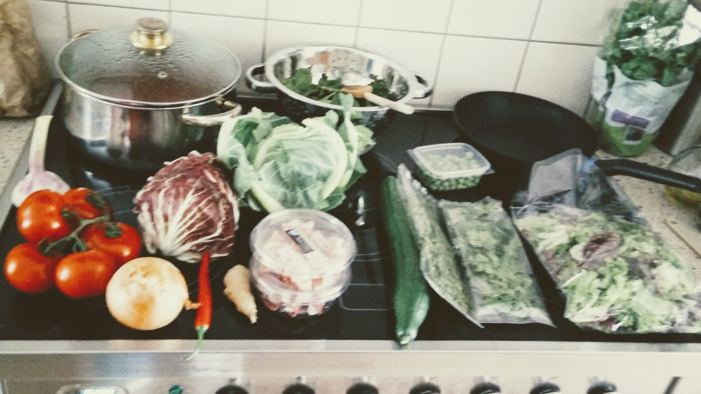
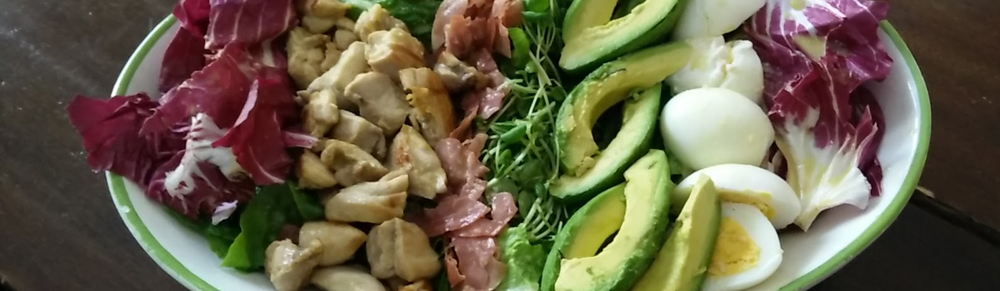

# Koken in Casa Bruna

> Een losse verzameling recepten die mij wel smaken

\pagebreak
# kookboek

Mijn eerste kookboek, een test.

Vereisten:

  * pandoc, met pdflatex
  * ghostcript

\pagebreak# Couscous met geroosterde groenten en citroendressing

Komt van een bakje voer van de M&S. Erg lekker, wel net iets te zoet, dus rustig aan met de suiker. Verder geen recept bekend, de ingredienten komen van de verpakking.

## Ingredienten

  * Aubergine
  * Courgette
  * Rode paprika
  * Rode uien
  * Peterselie
  * Citroensap
  * Tomaten
  * Basilicumolie (?)
  * Suiker
  * Zout
  * Witte wijnazijn
  * Knoflookpuree
  * Zwart mosterdzaad
  * Peper

## Bereidingswijze

Geen recept bekend.

## Opmerkingen

De M&S is allang weg uit Den Haag :)

## Pica

\pagebreak
# Kalfsblanquette met champignons

Stoofgerecht voor de Creuset.

## Ingredienten

  * 1 kg kalfsstoofvlees, in stukken van 4 cm
  * 250 g kalfsgehakt
  * 1 sjalot
  * 1 stengel prei
  * 250 g   verschillende soorten champignons (kastanje, shiitake, oesterzwam, beukenzwam)
  * 20 zilveruitjes
  * 400 ml kalfsbouillon Maggi
  * 200 ml melk
  * 200 ml room
  * 1 bouquet garni
  * 3 kruidnagels
  * 3 eieren
  * 2 el paneermeel
  * 3 el bloem
  * 4 el boter
  * halve citroen, het sap
  * 3 takjes bladpeterselie
  * peper - zout

## Bereidingswijze

Meng het kalfsgehakt met 1 losgeklopt ei, twee eetlepels paneermeel en gehakte peterselie. Maak er gehaktballetjes van ter grootte van een pingpongballetje.

Bak het stoofvlees en de gehaktballetjes in een ruime stoofpot rondom bruin. Voeg daarna het gesneden sjalotje, prei, selder, zilveruitjes, bouquet garni en kruidnagels, in een theebuiltje, toe. Laat 5 minuten stoven, roer af en toe om.

Voeg de kalfsbouillon toe en giet er water bij tot het geheel onder staat. Breng langzaam aan de kook en laat minstens 1 uur zacht koken.

Haal het vlees en de groenten uit de stoofpot. Houd deze warm. Zeef de bouillon.

Smelt 2 el boter in een grote pan, voeg 3 el bloem toe en laat kort bakken. Giet de bouillon en melk er beetje bij beetje bij. Breng aan de kook en blijf roeren tot een gladde saus. Haal van het vuur.

Roer de room en 2 eierdooiers door elkaar en roer dit door de saus. De saus mag niet meer koken, anders schift deze.

Bak de champignons kort en hevig met 1 el boter. Voeg het vlees en de champignons toe aan de saus. Breng op smaak met versgemalen peper, zout en citroensap. Serveer met bruine rijst.

## Opmerkingen

## Pica

\pagebreak
# Cannelloni al Radicchio

## Ingredienten

  * Cannelloni
  * Bechamelsaus
  * Emmertaler kaas
  * Knoflook
  * Parma kaas

## Bla

## Bereidingswijze

## Opmerkingen

## Pica

\pagebreak
# Pesto

## Ingredienten

  * Basilicum
  * Pijnboompitten
  * Parmezan
  * Ansjovis
  * Knoflook

## Bla

## Bereidingswijze

## Opmerkingen

## Pica

\pagebreak
# Pizza

## Ingredienten

## Bla

## Bereidingswijze

## Opmerkingen

## Pica

\pagebreak
# Qui­che ca­pre­se

## Ingredienten

  * 6 plakjes roomboterbladerdeeg (diepvries, ontdooid)
  * Wat basilicum
  * 100 g Parmezaanse kaas
  * 125 g mozzarella
  * 80 g pijnboompitten
  * 400 g cherrytomaten
  * 4 eieren
  * 125 g crème fraîche
  * 4 romatomaten

## Bla

Romatomaten hebben stevig vruchtvlees en behouden hun vorm daarom goed in deze quiche caprese.

## Bereidingswijze

  - Verwarm de oven voor op 180 graden. Bekleed de ingevette springvorm met het bladerdeeg.
  - Snijd de basilicumblaadjes fijn, rasp de kaas en snijd de mozzarella in plakjes.
  - Rooster de pijnboompitten 3 min. in een koekenpan zonder olie of boter. Laat afkoelen op een bord. Verdeel de pijnboompitten en cherrytomaten over de quichebodem.
  - Klop de eieren los met de crème fraîche. Schep het basilicum en de Parmezaanse kaas erdoor en breng op smaak met peper en zout. Verdeel het eimengsel en de mozzarella over de tomaten. Snijd de romatomaten in plakken en leg op de quiche.
  - Bak in ca. 55 min. in het midden van de oven goudbruin en gaar. Dek af met aluminiumfolie als hij te donker wordt. Laat in 1 uur afkoelen. Bon appétit!

## Opmerkingen

springvorm van 24 cm

## Pica

\pagebreak# Pizza

## Ingredienten

  * Rijst
  * Ui
  * Artisjokken
  * Groene asperge
  * Courgette
  * Peen
  * Doperwtjes
  * Peterselie

## Bla

## Bereidingswijze

## Opmerkingen

## Pica

\pagebreak
# Langzaam gestooft rundervlees in donker bier

## Ingredienten

  * 35 gr bloem
  * 750 gr riblappen in blokjes van 3 cm.
  * olijfolie
  * 2 stengels bleekselderij, fijngesneden
  * 3 tenen knoflook, fijngehakt
  * 125 gr spekblokjes
  * 2 el tomatenpuree
  * 250 ml donker bier
  * 500 ml runderbouillon
  * 1 laurierblaadje
  * 90 gr gedroogde pruimen zonder pit, gehakt
  * klontje boter
  * 250 gr sjalotjes, gepeld
  * 3 kleine winterwortels, in stukjes

## Bla

Je moet er even de tijd voor nemen, maar dan heb je ook wel een heerlijke runderstoofpot. Voor 3 à 4 personen uit Delicious van maart 2012.

## Bereidingswijze

Verwarm de oven voor op 150 C.
Meng zout en peper door de bloem en bestuif het vlees licht met de bloem.
Bewaar de rest van de bloem.
Verhit olie in een ovenvaste braadpan en bak het vlees in delen 3 à 4 minuten bruin.
Haal uit de pan en zet apart.
Bak de bleekselderij, knoflook en spek in de pan ongeveer 3 minuten.
Voeg de bloem en tomatenpuree toe en bak 1 minuut.
Voeg het vlees, het bier, laurierblad, pruimen en de bouillon toe en breng langzaam aan de kook.
Dek de pan af en laat 3 uur stoven in de oven.
Verhit boter in een pan en roerbak de sjalotjes 4 minuten.
Voeg de sjalotjes en wortel toe aan de stoofschotel en zet nog een uur in de oven.

## Opmerkingen

Gegeten bij de Poeckers. Lekk0r!

\pagebreak
# Italiaanse stoof met wijn

## Ingredienten

  * 1 kg riblappen
  * 3 uien
  * 4 teentjes knoflook
  * Verse tijm
  * Laurierbladeren
  * 2 eetlepels bloem
  * 1 eetlepel suiker
  * 1 liter gezeefde tomaten
  * 3 vleestomaten
  * Peterselie
  * Bosui
  * 2 glazen rode wijn
  * citroen (schil en sap)
  * Zwarte olijven zonder pit

## Blabla

## Bereiding

Verwarm de oven voor op 150 graden.

Riblappen in stukken snijden. Snipper de ui grof. Snipper de knoflooktenen.
Braad de blokjes vlees bruin en zet in een pannetje apart.
Fruit de ui. Voeg de bloem, knoflook tijm en laurier toe en bak kort. Blus af met de wijn en laat kort koken. Voeg te gezeefde tomaten, suiker en citroen, zout en peper toe.
Doe alles in de gietijzeren pan en zet voor 3 á 4 uur in de oven.

Snijd de tomaten en de olijven in blokjes. Meng de peterselie. Bestrooi het vlees vlak voor serveren met die mengsel.

## Opmerkingen

Via Marco. Gegeten op de verjaardag van P. Er lekker! C minder enthousiast.

\pagebreak
# Cobb salad

## Ingredienten

### Dressing

  * 50 cm water
  * 50 cl rode wijnazijn
  * 1/2 tl suiker
  * 2 tl citroensap
  * 1 tl gemalen zwarte peper
  * 1 tl Worcestershiresaus
  * 1/2 tl droge Engelse mosterd
  * 1 teentje knoflook, fijngehakt
  * 50 cl olijfolie

### Salade 

  * 1/2 ijsbergsla
  * 1/2 rode salade of lollo rosso
  * 1 zakje waterkers
  * 2 tomaten, ontveld 
  * 6 plakken bacon (neem gerookte hamsoort)
  * 2 gebraden kipfilets
  * 3 hardgekookte eieren
  * 1 avocado
  * 100 gr Roquefort, verkruimeld

## Bla

## Bereidingswijze

Hak de beide slasoorten en de helft van de waterkers (na het wassen) grof en leg ze in een grote, liefst brede schaal. 
Snij de tomaten, avocado, kipfilet, bacon/ham (even uitbakken) en de eieren in stukjes. 
Schep dit bovenop de salade en strooi er de Roquefort over.
Dressing erover.

## Opmerkingen

Salade moet onder, de kip, bacon, eieren en tomaten en kaas vormen de strepen op de salade. Avocado kan er los over. Roquefort koud houden, anders is 'ie te zacht om te verkruimelen. Echt vullende maaltijdsalade, best wat werk om te maken.
Beviel erg 't gezin erg goed :-)

## Pica

\pagebreak
# Ragù Bolognese

## Ingredienten

(voor 4 porties)

  * 125 g spekblokjes of pancetta
  * 1 st winterpeen
  * 2 stengels bleekselderij
  * 1 st ui gesnipperd
  * 2 tenen knoflook
  * 200 g mager rundergehakt
  * 200 g kalfsgehakt
  * 150 ml witte wijn
  * 500 g gepelde tomaten kan ook uit blik
  * 1 blokje runderbouillon
  * peper
  * zout
  * olijfolie

## Bla

Bolognesesaus is geen tomatensaus een vleessaus. Door het uren sudderen krijgt het een hartige smaak die je enigszins doet denken aan stoofvlees.In 1982 heeft de afdeling uit Bologna van de ‘Accademia Italiana della Cucina’ de ingrediënten voor de officiële Ragù bolognese vastgelegd. 

## Bereidingswijze

Snipper de ui en snijd de peen en de bleekselderij in kleine blokjes. Haal de knoflooktenen door de knoflookpers.
Verhit een laagje olijfolie in een grote braadpan of diepe kookpan. Zodra de olie heet is, voeg er de fijngesneden groente aan toe samen met de spekblokjes. Bak alles ongeveer 10 minuten op laag vuur, zodat de groenten zacht worden.
Voeg het runder- en kalfsgehakt toe en bak het geheel nog eens tien minuten op zacht vuur, totdat het vlees gaar is. Rul het gehakt door regelmatig met een houten lepel te roeren. Breng het geheel op smaak met wat peper en zout.
Giet de witte wijn erbij. Laat alles rustig koken op laag vuur tot het vocht is ingedampt.
Snijd de tomaten in stukjes en doe ze in de pan. Giet zo’n 250 ml water er bij en los hier het bouillon blokje in op. Breng het geheel aan de kook en laat het geheel inkoken. Vergeet niet om regelmatig te roeren om aanbranden van de saus te voorkomen.
Je kunt nu de pan met de saus het beste in een oven op 150 graden Celsius plaatsen. De saus kan zo rustig doorsudderen en dit is erg belangrijk voor het ontwikkelen van de juiste smaak.
Haal na 2 á 3 uur de pan uit de oven. Indien het nodig is kun je de saus nog enigzins inkoken op een medium vuur. Roer hierna de room door de saus en laat deze nog even zachtjes koken.

## Opmerkingen

\pagebreak
# Chimichirri

## Ingredienten

4 tenen knoflook
4 takjes verse oregano
¼ rode peper
1 tomaat
¼ ui heel fijngesnipperd
1 bosje peterselie
Enkele druppels citroen / limoen
50 ml olijfolie
50 ml rode wijnazijn
Peper en zout
Optioneel: 4 verse laurierbladeren
Optioneel: 4 takjes munt en / of koriander

## bla

Chimichirri is een lichtzure ietwat pittige saus en kruiderij (zelfs een marinade) die de Argentijnen zowat bij alles gebruiken. Het wordt meestal gebruikt bij gegrilde steak, maar ook in andere gerechten kan het een leuke twist geven.

## Bereidingswijze

Snijd alle ingrediënten fijn. Meng dan eerst de knoflook, oregano en verse laurier en rode peper in een vijzel zodat de geuren vrijkomen. Voeg de peterselie, tomaat, ui, citroen, olijfolie en rode wijnazijn toe en meng goed met een vork. De ingrediënten moeten bedekt zijn onder de olie en azijn. Breng op smaak met peper en zout.

## Opmerkingen

Ruim peterselie om het goed groen te krijgen. Erg goed, wel zeker een dag laten staan voor de perfecte smaak.

\pagebreak
# Groentensoep

## Ingredienten

  * 1 ui
  * 3 dunne preistengels
  * 2 flinke wortels
  * 1 liter bouillon (runder of groente, kan beiden). Wel echt met een schenkel enzo. Regulier Bblok erbij.
  * Peterselie
  * 2 teentjes knoflook
  * 1 eetlepel boter
  * 1 aardappel
  * Doperwtjes(niet uit blik!)
  * Peper en zout naar smaak

## Bla

Tsja, soep van groenten he.

## Bereidingswijze

De uien pellen en snipperen
De wortels schoonmaken en in kleine blokjes snijden
De aardappel schillen en in blokjes snijden
Zet een pan op het vuur met wat boter en bak hierin de uien glazig
Dan de wortel en de aardappelblokjes toevoegen met de uitgeperste knoflookteentjes, laat dit nog een paar minuten zachtjes bakken
Ondertussen de prei schoonmaken en in halve ringen snijden
Bleekselderij ook fijn snijden
Bleekselderij en prei ook nog even meebakken
Nu de bouillon toevoegen en de soep aan de kook brengen
Laat de soep 20 minuten zachtjes doorkoken
Even proeven en naar smaak peper en zout toevoegen (je kunt ook een extra bouillonblokje verkruimelen boven de soep)
Peterselie vlak voor het serveren toevoegen

## Opmerkingen

Ik zou hier niet meer experimenteren. Eenvoudig is goed.

\pagebreak
# Dit was het

\pagebreak
