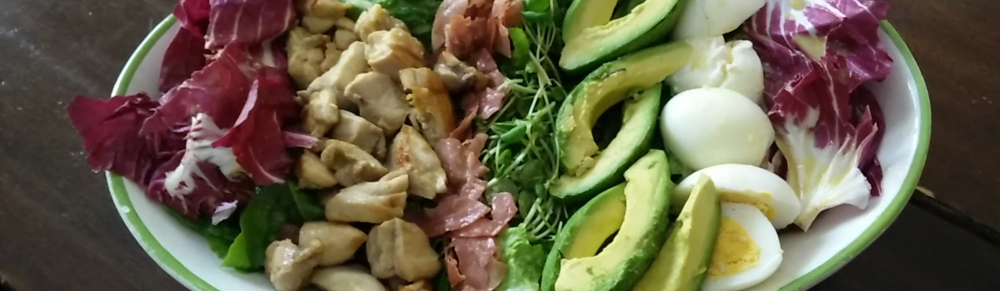

# Cobb salad

## Ingredienten

### Dressing

  * 50 cm water
  * 50 cl rode wijnazijn
  * 1/2 tl suiker
  * 2 tl citroensap
  * 1 tl gemalen zwarte peper
  * 1 tl Worcestershiresaus
  * 1/2 tl droge Engelse mosterd
  * 1 teentje knoflook, fijngehakt
  * 50 cl olijfolie

### Salade 

  * 1/2 ijsbergsla
  * 1/2 rode salade of lollo rosso
  * 1 zakje waterkers
  * 2 tomaten, ontveld 
  * 6 plakken bacon (neem gerookte hamsoort)
  * 2 gebraden kipfilets
  * 3 hardgekookte eieren
  * 1 avocado
  * 100 gr Roquefort, verkruimeld

## Bla

## Bereidingswijze

Hak de beide slasoorten en de helft van de waterkers (na het wassen) grof en leg ze in een grote, liefst brede schaal. 
Snij de tomaten, avocado, kipfilet, bacon/ham (even uitbakken) en de eieren in stukjes. 
Schep dit bovenop de salade en strooi er de Roquefort over.
Dressing erover.

## Opmerkingen

Salade moet onder, de kip, bacon, eieren en tomaten en kaas vormen de strepen op de salade. Avocado kan er los over. Roquefort koud houden, anders is 'ie te zacht om te verkruimelen. Echt vullende maaltijdsalade, best wat werk om te maken.
Beviel erg 't gezin erg goed :-)

## Pica

